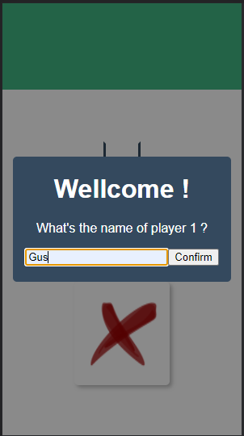
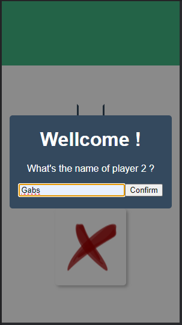
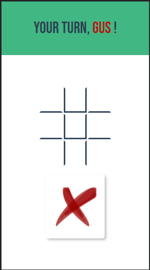
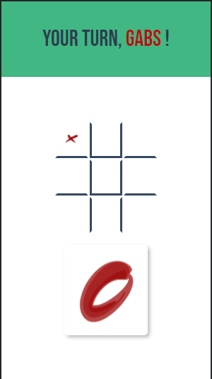

# JOGO DA VELHA | PROJETO PARA APRENDIZADO


## Indice:

- [Instalação](#instalação)
  - [Configuração do projeto](#configuração-do-projeto)
  - [Compilação](#compilação)
- [Sobre](#sobre)


## Instalação:

### Configuração do projeto:

``` npm install ```

### Compilação:

``` npm run serve```


## Sobre:

O projeto é uma implementação do jogo intitulado "Jogo da Velha". Inicialmente os usuários devem inserir o nome dos jogadores:


<p align='center'>
	
    
</p>


Posteriormente, seguindo a dinâmica do Jogo da Velha, cada jogador representa um símbolo, X ou O. O jogo é separado por turnos, onde os jogadores alternam suas jogadas, colocando seu símbolo em uma das casas vazias de uma grade de 3 por 3, cujo objetivo é ser o primeiro jogador a formar uma linha reta de símbolos iguais, podendo ser em formato de linha, coluna ou diagonal:


<p align='center'>
	
    
</p>


Quando todos as casas do tabuleiro estão preenchidas e tal objetivo não foi alcançado por nenhum dos jogadores, o jogo termina em empate.
